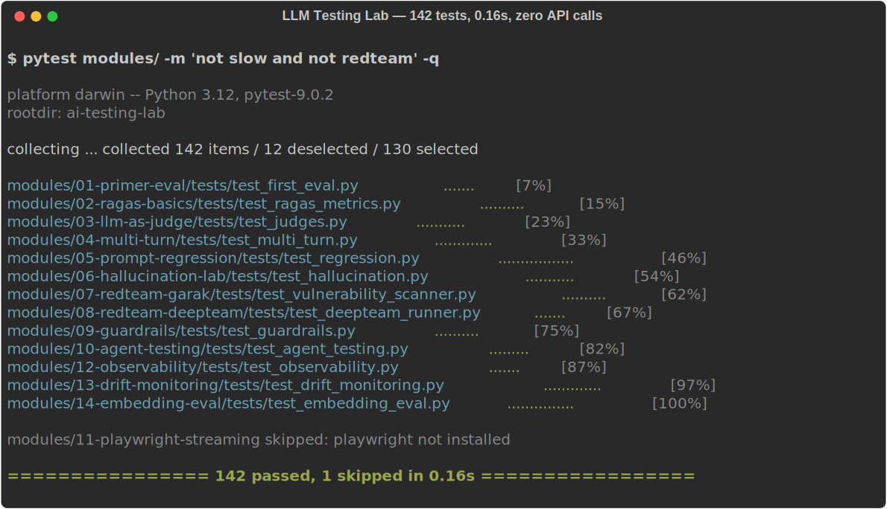

# LLM Testing Lab

**14 pytest modules covering every layer of LLM quality assurance — RAG evaluation, red teaming, guardrails, observability, and drift monitoring. Zero API calls needed to run the full suite.**

[](https://github.com/gonzaloMorenoc/ai-testing-lab/actions/workflows/ci.yml)
[](https://codecov.io/gh/gonzaloMorenoc/ai-testing-lab)
[](https://www.python.org/)
[](LICENSE)
[](https://vscode.dev/redirect?url=vscode://ms-vscode-remote.remote-containers/cloneInVolume?url=https://github.com/gonzaloMorenoc/ai-testing-lab)

<p align="center">
  
</p>

---

## Why this exists

Most LLM quality guides stop at "use DeepEval" or "use RAGAS". This lab goes further: it shows you **how** each evaluation technique works under the hood, where it breaks, and how to combine them into a real QA pipeline.

Every module is self-contained, runs in milliseconds with deterministic mocks, and teaches one specific concept — from writing your first `LLMTestCase` to detecting semantic drift in production.

---

## Quickstart

```bash
git clone https://github.com/gonzaloMorenoc/ai-testing-lab.git
cd ai-testing-lab
pip install deepeval pytest pytest-cov numpy
pytest modules/01-primer-eval/tests/ -m "not slow" -q
```

Expected output:

```
........ 8 passed in 0.12s
```

No API key. No paid account. No internet connection required.

> For modules marked `@pytest.mark.slow`, export a free `GROQ_API_KEY` before running `pytest -m slow`.

---

## Run the full suite

```bash
pytest modules/ -m "not slow and not redteam" -q
```

```
142 passed, 1 skipped in 0.16s
```

142 tests across 14 modules in under 200ms.

---

## Modules

| # | Module | Tests | Key concept |
|---|--------|:-----:|-------------|
| 01 | [primer-eval](modules/01-primer-eval/) | 8 | First `LLMTestCase` · AnswerRelevancy · Faithfulness |
| 02 | [ragas-basics](modules/02-ragas-basics/) | 10 | RAGAS pipeline · faithfulness · context\_precision · recall |
| 03 | [llm-as-judge](modules/03-llm-as-judge/) | 11 | G-Eval · DAG Metric · position bias · verbosity bias |
| 04 | [multi-turn](modules/04-multi-turn/) | 10 | ConversationalTestCase · KnowledgeRetention · 8-turn context |
| 05 | [prompt-regression](modules/05-prompt-regression/) | 11 | PromptRegistry · RegressionChecker · statistical significance |
| 06 | [hallucination-lab](modules/06-hallucination-lab/) | 9 | Claim extraction · groundedness · negation detection |
| 07 | [redteam-garak](modules/07-redteam-garak/) | 10 | 42 attack prompts · DAN · many-shot · token manipulation |
| 08 | [redteam-deepteam](modules/08-redteam-deepteam/) | 8 | OWASP Top 10 LLM 2025 · prompt injection · agency risks |
| 09 | [guardrails](modules/09-guardrails/) | 11 | PII detection · output validation · I/O pipeline |
| 10 | [agent-testing](modules/10-agent-testing/) | 9 | Tool selection · trajectory evaluation · AST-safe eval |
| 11 | [playwright-streaming](modules/11-playwright-streaming/) | 8 | SSE streaming · E2E chatbot UI · FastAPI mock server |
| 12 | [observability](modules/12-observability/) | 8 | OTel spans · `@trace` decorator · latency · error tracking |
| 13 | [drift-monitoring](modules/13-drift-monitoring/) | 13 | PSI · AlertHistory · trend detection · alert rules |
| 14 | [embedding-eval](modules/14-embedding-eval/) | 15 | Cosine similarity · centroid shift · semantic regression |

---

## What you'll learn

```
Evaluation pyramid for LLMs
│
├── Unit-level metrics
│   ├── 01  LLMTestCase, AnswerRelevancy, Faithfulness
│   ├── 02  RAGAS: faithfulness, context_precision, context_recall
│   ├── 03  LLM-as-judge: G-Eval, position bias calibration
│   └── 14  Embedding cosine similarity, regression checker
│
├── Conversation & regression
│   ├── 04  Multi-turn: ConversationalTestCase, 8-turn memory
│   ├── 05  Prompt regression: PromptRegistry, z-test significance
│   └── 06  Hallucination: claim extraction, negation-aware groundedness
│
├── Security & safety
│   ├── 07  Red teaming: 42 attack prompts, hit rate by category
│   ├── 08  DeepTeam: OWASP Top 10 LLM 2025, agency risks
│   └── 09  Guardrails: PII detection, I/O validation pipeline
│
└── Production monitoring
    ├── 10  Agent evaluation: tool accuracy, trajectory scoring
    ├── 11  E2E streaming: Playwright + SSE + FastAPI
    ├── 12  Observability: OTel, Langfuse, Phoenix
    └── 13  Drift monitoring: PSI, AlertHistory, trend analysis
```

---

## Repo layout

```
ai-testing-lab/
├── modules/          # 14 independent labs (start anywhere)
├── demos/            # live systems to test against (RAG, Streamlit, Rasa)
├── goldens/          # versioned evaluation datasets
├── docs/             # chapter-by-chapter manual + glossary
├── exercises/        # solutions per module
└── docker/           # Langfuse + Ollama + demo stack
```

---

## Design principles

- **No API calls in fast tests.** Every module runs offline with deterministic mocks. Real LLM calls are gated behind `@pytest.mark.slow`.
- **One concept per module.** Each lab teaches exactly one evaluation technique. You can read and run them in any order.
- **Production patterns, not toy examples.** AlertHistory, PSI drift detection, position-bias calibration, and AST-safe evaluation are patterns you'd actually ship.
- **pytest-native.** If you know pytest, you already know how to run this.

---

## Stack

| Tool | Used for |
|------|----------|
| [DeepEval](https://deepeval.com) | pytest-native evaluation, 50+ metrics, LLM-as-judge |
| [RAGAS](https://docs.ragas.io) | Reference-free RAG metrics |
| [Promptfoo](https://promptfoo.dev) | Prompt regression, YAML test matrices |
| [Garak](https://github.com/NVIDIA/garak) | LLM vulnerability scanner (NVIDIA) |
| [Guardrails AI](https://guardrailsai.com) | I/O validation for LLMs |
| [NeMo Guardrails](https://github.com/NVIDIA/NeMo-Guardrails) | Conversational rails (Colang DSL) |
| [Langfuse](https://langfuse.com) | Tracing, online evaluation (MIT, self-hostable) |
| [Phoenix](https://github.com/Arize-ai/phoenix) | OSS observability (OTel, auto-instrumentation) |

---

## Contributing

- **Found a metric that doesn't correlate with human judgment?** Open an issue with the specific case.
- **Have a golden example to add?** Follow the format in `goldens/README.md` and open a PR.
- **Proposing a new module?** Open an issue with the concept and the nearest existing module as reference.
- **Fixing the manual?** Factual errors or broken links in `docs/` — direct PR is fine.

No PR template required. Describe what changed and why.

---

## License

MIT © 2026 Gonzalo Moreno
